# Udacity_Tennis_project

### Introduction
This repo contains my solution to the challenge for the project Collaboration and Competition part of the Udacity Deep Reinforcement 
Learning Nanodegree. My solution covers 8 different variants of D4PG. I tried different number of agents [2,4,8,16] to provide distributed gathering experience
and 2 activation gates use on the actor and critic network models (Relu and Leaky Relu)

The solution is fully tested with the tennis agent working in Windows 11 64 bits.

The application solves the environment with the following 8 implementations
- Mode 1 2 D4PG agents Leaky-Relu Gate
- Mode 2 2 D4PG agents Relu Gate
- Mode 1 4 D4PG agents Leaky-Relu Gate
- Mode 2 4 D4PG agents Relu Gate
- Mode 1 8 D4PG agents Leaky-Relu Gate
- Mode 2 8 D4PG agents Relu Gate
- Mode 1 16 D4PG agents Leaky-Relu Gate
- Mode 2 16 D4PG agents Relu Gate

### Installation
My solution works as an stand alone application which run in a Windows Pro 11 64 bits command line window 
(I did not try in Linux, but I suspect that with minimum changes it will work). 

### Setup the environment
1.- create a conda environment    
    
    conda create --name drlnd python=3.6 
    activate drlnd

2.- install gym libraries
    
    pip install gym or pip install gym[atari] 

3.- clone this repo

    git clone https://github.com/olonok69/Udacity_Tennis_project.git
    cd Udacity_Tennis_project

4.- install rest of dependencies (I left a file with the content of all libraries of my setup named pip_library.txt)

    pip install -r requirements.txt
    
5.- install a kernel in jupyter(optional)
    
    python -m ipykernel install --user --name drlnd --display-name "drlnd"

6.- Install Unity agent (in repo you have the windows 64 version, but if you plan to install it) (

  
- Linux https://s3-us-west-1.amazonaws.com/udacity-drlnd/P3/Tennis/Tennis_Linux.zip
- MacOs https://s3-us-west-1.amazonaws.com/udacity-drlnd/P3/Tennis/Tennis.app.zip
- Win32 https://s3-us-west-1.amazonaws.com/udacity-drlnd/P3/Tennis/Tennis_Windows_x86.zip
- Win64 https://s3-us-west-1.amazonaws.com/udacity-drlnd/P3/Tennis/Tennis_Windows_x86_64.zip

  Version 2: Twenty (20) Agents

### Environment

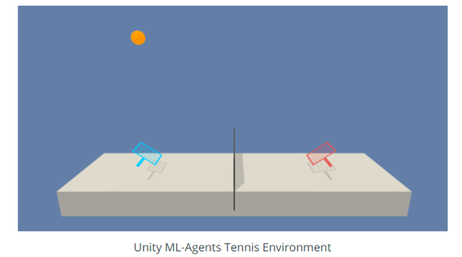

In this environment, two agents control rackets to bounce a ball over a net. If an agent hits the ball over the net, it receives a reward of +0.1. If an agent lets a ball hit the ground or hits the ball out of bounds, it receives a reward of -0.01. Thus, the goal of each agent is to keep the ball in play.

The observation space consists of 8 variables corresponding to the position and velocity of the ball and racket. Each agent receives its own, local observation. Two continuous actions are available, corresponding to movement toward (or away from) the net, and jumping.

The task is episodic, and in order to solve the environment, your agents must get an average score of +0.5 (over 100 consecutive episodes, after taking the maximum over both agents). Specifically,

After each episode, we add up the rewards that each agent received (without discounting), to get a score for each agent. This yields 2 (potentially different) scores. We then take the maximum of these 2 scores.
This yields a single score for each episode.
The environment is considered solved, when the average (over 100 episodes) of those scores is at least +0.5 
**Note: (In this implementation I consider solver if at least scores +0.8 in average over 100 episodes)**

### how to run this project

--mode training|play|plot|hp_tuning  Mandatory
	training  Train and agent. Save a model policy if the agent get more or equals than +.8 
	play  play an agent with a save policy and report the score
plot  generate the plot from information collected in compare modes
hp_tuning  hyper parameter tuning example
-- nagents Mandatory
	Number of d4pg agents , choose between [2,4,8,16]
-- af Mandatory
	Activation function 1--> Leaky Relu or 2--> Relu
Ex. python .\main.py --mode training --nagents 8 --af 1

### Directory Structure
* Tennis_Windows_x86_64: the unity environment
* Images: Folder where I save plots during training and final plots
* videos: Folder where I save a video of playing the game loading a policy from files
* Checkpoints: Folder where I save the operational models
* Outputs: Folder where I save a pickle file containing a dictionary which contains all data to build the final plots and this report
* src: contains python scripts with classes to support the application

###files
* root
  - Main.py: Contains the logic which govern the 8 main operations modes
  
* In src folder
  - Agents.py: contains classes which wrap the operation of the d4pg single agent
  - magents.py: contains classes which wrap the operation of the multi-agent working with different algorithms and buffers. Additionally, some functions to operate the env in training or play mode
  - Networks.py : contains different implementation of Neural Network architectures use by the agents to solve the environment
  - Hyper.py : contains implementation of a simple hyper-parameter tuning logic to optimize 4 parameters using Bayesian Optimization and Hyperopts library.
  - Utils.py: contains helpers to monitor, plot and instantiate the agents, together with buffers classes, Noise classes and others to support the application

* In videos folder
  - Video example in play mode

* In images folder
  - diferent plost, loss , score, time training etc

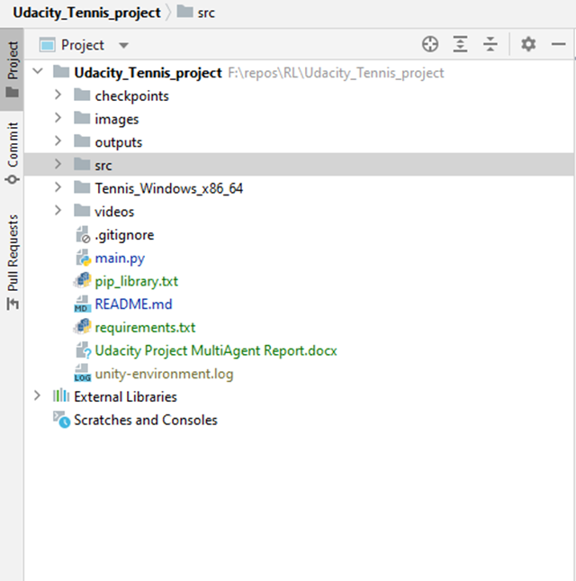

* the script during training is printing the average reward every episode and the size of the buffer to show the impact of the number of agents when we are gathering experience

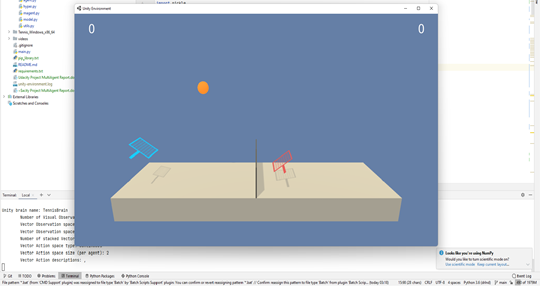

* and during training mode we save loss and rewards to finally plot them one the game finish, which is either after 1000
episodes or where the agent reach 0.8+ as reward in training

Ex. Rewards

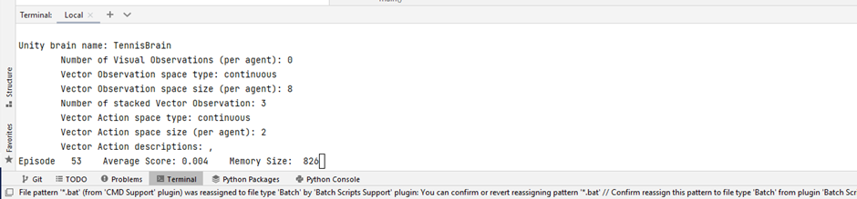

* also I plot individually score , actor loss and critic loss per variant
* Scores

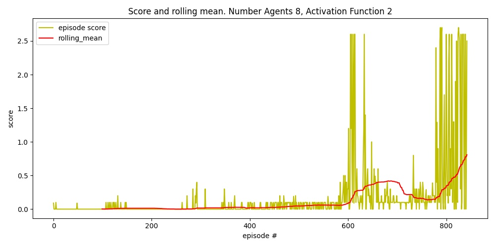

* Actor Loss

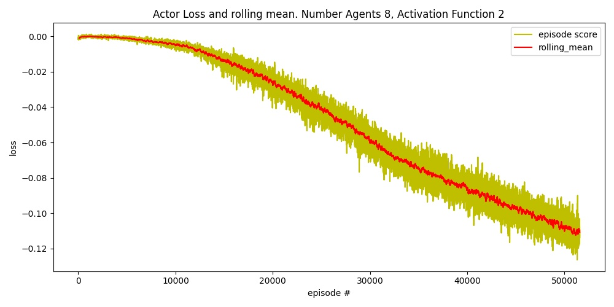

* Critic Loss

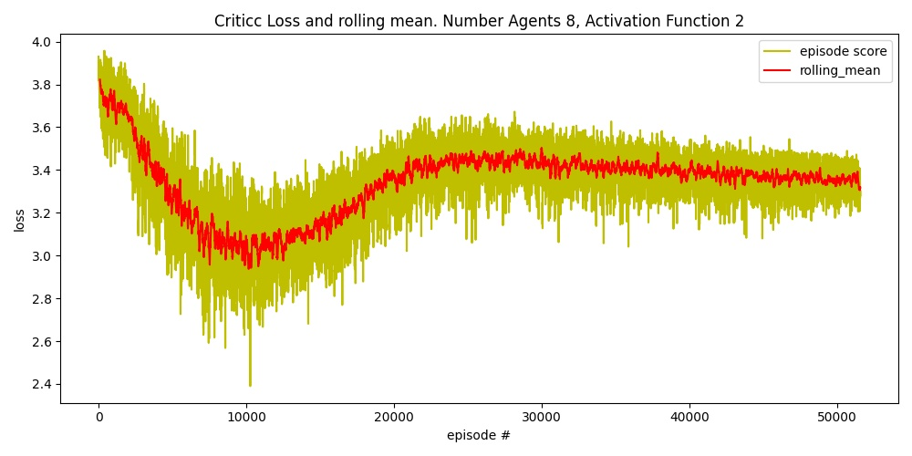

### Mode plot
after runing the application in mode compare and the compare_play, where the app collect information to later in mode 
plot generate 4 graphs which compare the performance of the 8 solvers

Reward up to solve the environment 0.8+ reward (Max reward obtained in legend)

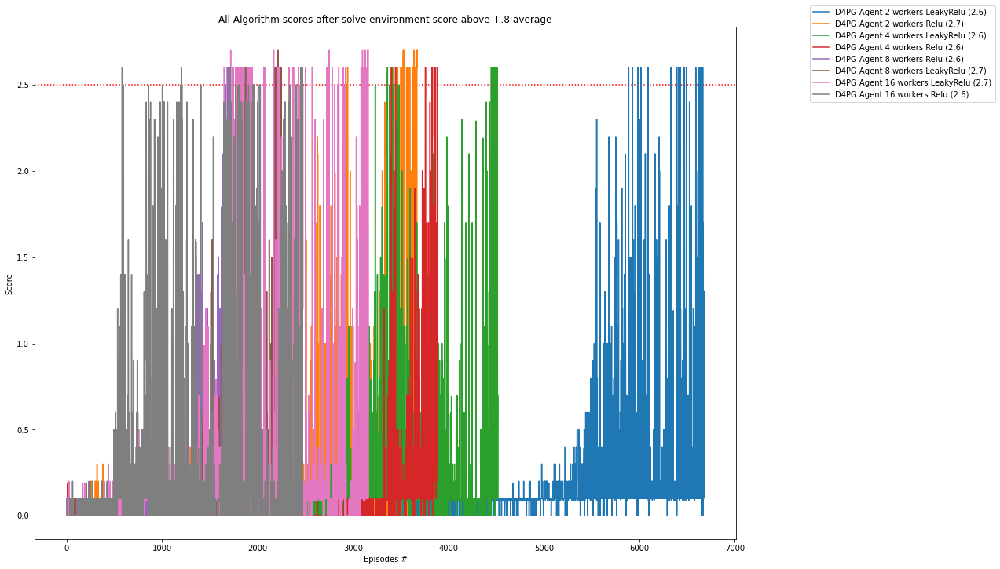

Reward of playing with best saved policy (score mean 0.8+ / 100 episodes during training). Average 3 Episodes

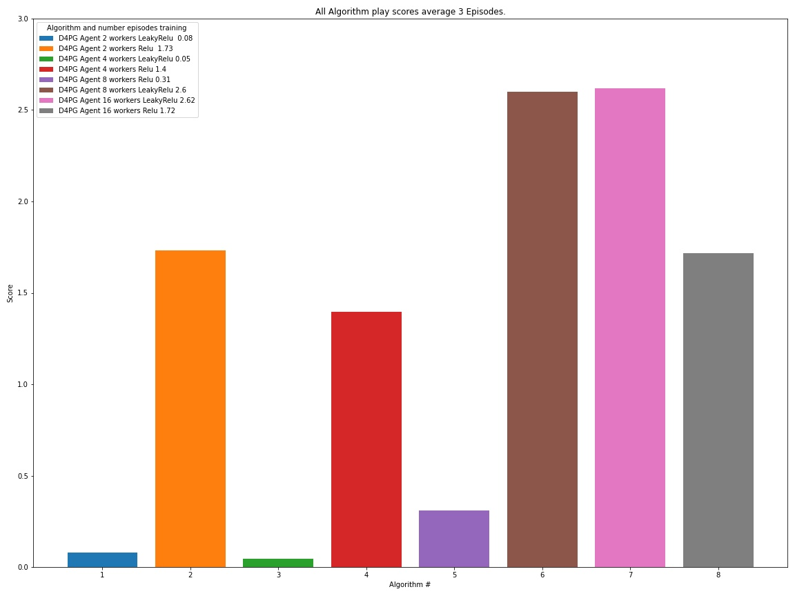

Training Time (Time to solve the environment. 0.8+ mean reward)

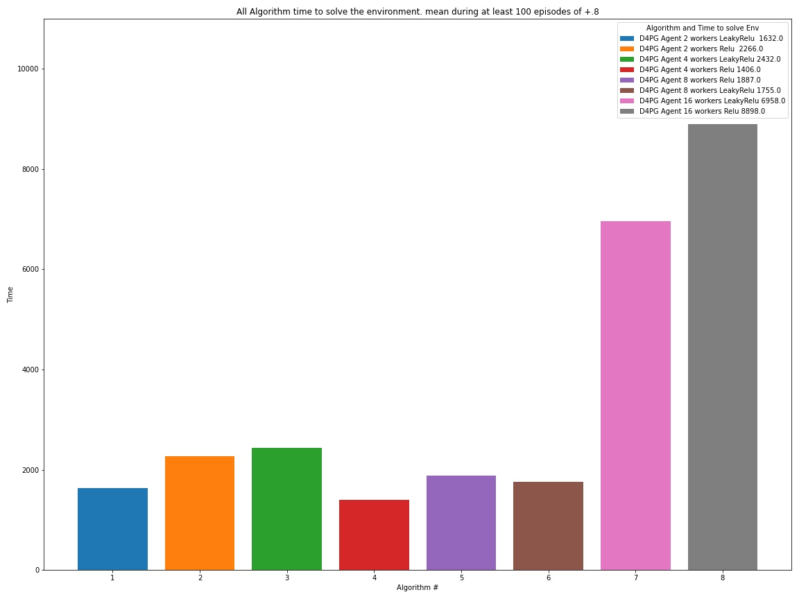

Number of Episodes (Number of Episodes to solve the environment. 0.8+ mean reward)

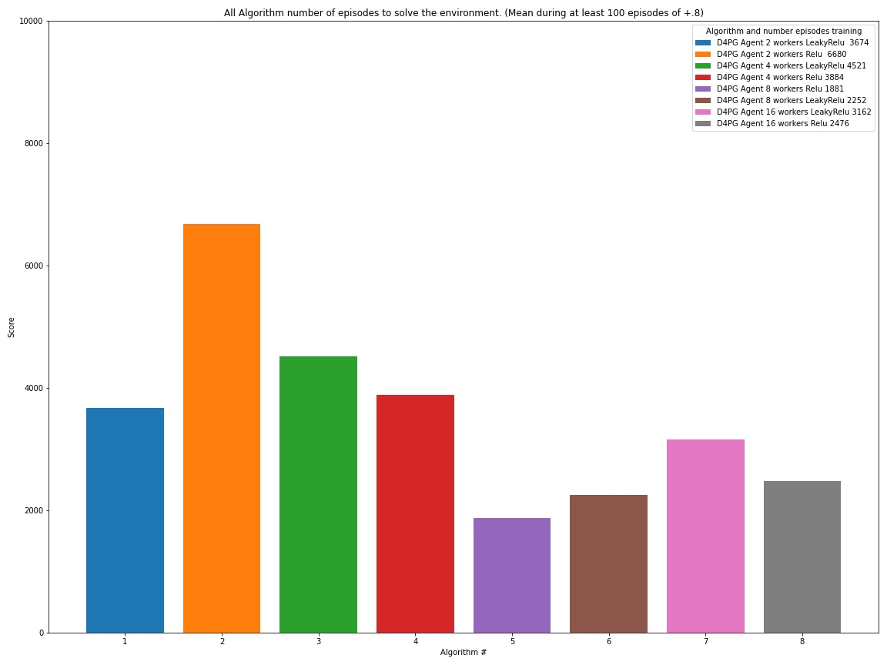

### Mode hp_tuning

In mode hp_tuning and using library Hyperopt library, I setup an example of how to optimize parameters of an agent using Bayesian Optimization. It it’s just a simple example but give you a grasp of how we can optimize the parameters. There are other frameworks to optimize parameters like RL Baselines3 Zoo if we use Stable baselines library or Ray for unity RL agents, but here as this is a tailored environment, I decided to use a general optimization framework and learn how to use it in Deep RL. Here in this simple configuration, I am optimizing 4 parameters of the D4PG agent model, and I limit the trials to 30 for this experiment

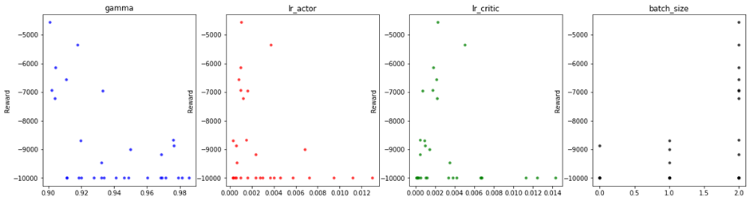

### References

1.	DDPG:T. P. Lillicrap et al., "Continuous control with deep reinforcement learning." arXiv preprint arXiv:1509.02971, 2015.
2.	OU Noise https://github.com/udacity/deep-reinforcement-learning/blob/master/    ddpg-pendulum/ddpg_agent.py
3.	https://en.wikipedia.org/wiki/Ornstein%E2%80%93Uhlenbeck_process
4.	D4PG https://openreview.net/pdf?id=SyZipzbCb
5.	Multi-Agent Actor-Critic for Mixed Cooperative-Competitive Environments https://arxiv.org/abs/1706.02275
6.	https://github.com/Curt-Park/rainbow-is-all-you-need
7.	https://github.com/MrSyee/pg-is-all-you-need
8.	Hands-on Reinforcement Learning for Games (Book) Michael Lanham
9.	Grokking Deep Reinforcement Learning (Book) Miguel Morales
10.	Hands-on Reinforcement Learning with Python (book) by Sudharsan Ravichandiran
11.	binary sum-tree. See Appendix B.2.1. in https://arxiv.org/pdf/1511.05952.pdf. Adapted implementation from https://github.com/jaromiru/AI-blog/blob/master/SumTree.py  
12.	SegmentTree from OpenAi repository. https://github.com/openai/baselines/blob/master/baselines/common/segment_tree.py
13.	PER implementation. https://github.com/rlcode/per/blob/master/prioritized_memory.py
14.	https://pytorch.org/docs

